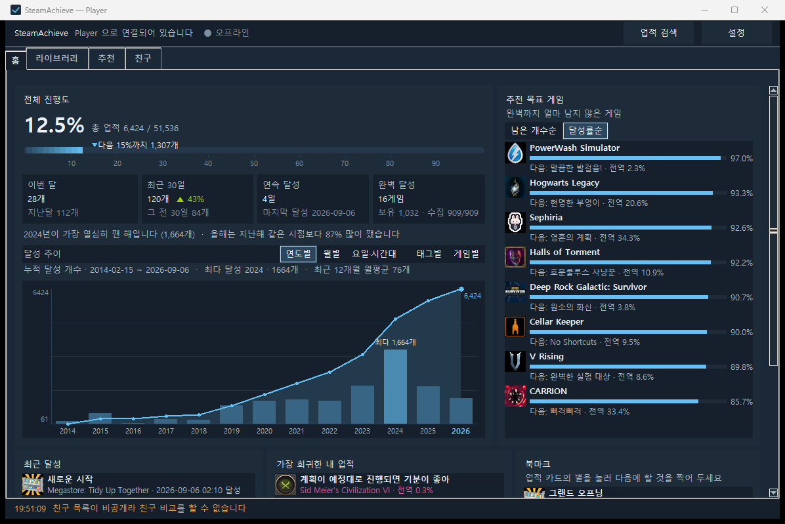
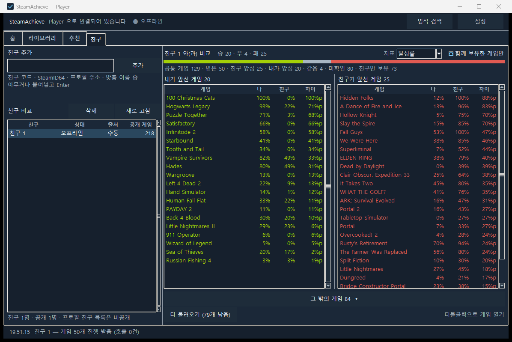

# SteamAchieve

스팀 계정의 업적 진행도를 한 화면에서 보는 Windows 데스크톱 앱입니다. 서버가 없는 완전 로컬 도구이며, 입력한 API 키와 SteamID 는 Steam 외 어디로도 가지 않습니다.

[English below](#english)



## 다운로드

**[최신 릴리스](https://github.com/winsting20/SteamAchieve-releases/releases/latest)** 에서 `SteamAchieve-<버전>-win64.zip` 을 받아 압축을 풀고 `SteamAchieve.exe` 를 실행하면 됩니다. 설치 과정은 없습니다.

- Windows 10 이상, 64bit. 파이썬 설치 불필요.
- 릴리스마다 `SHA256SUMS.txt` 가 함께 올라갑니다. 받은 파일이 원본인지 확인하려면 PowerShell 에서:
  ```powershell
  Get-FileHash .\SteamAchieve.exe -Algorithm SHA256
  ```
  나온 값이 `SHA256SUMS.txt` 의 값과 같아야 합니다.

## 무엇을 보여 주나

- **홈** — 전체 진행도, 마일스톤, 이번 달·최근 30일·연속 달성, 달성 추이(연도·월·요일·태그·게임), 추천 목표 게임, 최근 달성·희귀 업적·북마크(업적 설명·전역 달성률·진행 수치까지).
- **라이브러리** — 게임별 업적 카드/목록, 정렬·필터, 다음으로 쉬운 업적, 메모·북마크, 가이드·통계 바로가기, 업적 전역 검색(Ctrl+F), 진행형 업적의 진행도("8,988 / 10,000").
- **추천** — 아직 없는 게임을 업적 기준으로(프리셋 3종 × 정렬 8종, 태그·가격 필터, 보유 게임 취향으로 개인화, 스토어 국가별 통화).
- **친구** (옵트인) — 친구 코드·프로필 주소로 친구를 넣고 공통 게임의 진행률을 나란히 비교. 게임 화면에는 그 게임을 가진 친구들의 순위.
- 달성 알림, 월간 목표, 한국어·영어 UI, 글자 크기 3단계, 새 버전 확인(옵트인).
- 첫 실행은 3단계 위저드가 안내합니다(키 발급 → 계정 확인 → 게임 세부 정보 공개 확인).



## 첫 실행

1. `SteamAchieve.exe` 를 실행합니다.
2. SteamID64 또는 프로필 주소(`https://steamcommunity.com/id/...`)를 입력합니다.
3. Steam Web API 키를 입력합니다. **본인 키만 쓰고 남에게 주지 마세요.**
4. 연결을 누르면 끝입니다. 이후 실행부터는 바로 마지막 화면으로 이어집니다.

### Web API 키 발급
`https://steamcommunity.com/dev/apikey` 에서 발급합니다. 도메인 이름 칸은 아무 값(예: `localhost`)이나 됩니다. 발급된 키는 16진수 32자입니다.

키는 이 PC 의 `%APPDATA%\SteamAchieve\credentials.dat` 에 Windows DPAPI 로 암호화되어 저장되며, **Steam API 호출의 인증 파라미터로만** 쓰입니다. 앱이 접속하는 주소는 [PRIVACY.md](PRIVACY.md) 에 전부 적혀 있으니 방화벽·프록시로 직접 확인하셔도 됩니다.

### "게임 세부 정보" 공개 설정
`https://steamcommunity.com/my/edit/settings` → 개인정보 → **게임 세부 정보**를 "공개"로 두세요. 비공개면 보유 게임·업적 목록은 보이지만 **내가 달성했는지**만 403 으로 막히고, 앱은 그런 항목을 0% 가 아니라 "미확인"으로 표시합니다.

## SmartScreen · 백신 경고

이 앱은 PyInstaller 로 만든 단일 exe 이고 **코드 서명이 없는 개인 배포물**입니다. 처음 실행하면 Windows 가 파란 창으로 **"Windows의 PC 보호 — 인식할 수 없는 앱의 시작을 차단했습니다"** 를 띄웁니다. 바이러스라는 뜻이 아니라 **처음 보는 파일이라 아직 평판이 없다**는 뜻입니다.

**실행하는 방법** — 그 창에는 [실행 안 함] 버튼만 크게 보입니다. 실행하려면:

1. 창 왼쪽 위의 작은 글씨 **"추가 정보"** 를 누릅니다(버튼이 아니라 링크라 눈에 잘 안 띕니다).
2. 그러면 아래에 **[실행]** 버튼이 나타납니다. 그것을 누릅니다.

**zip 을 푼 뒤에도 막힌다면** — 인터넷에서 받은 zip 은 안에 든 파일까지 "차단됨" 표시가 붙습니다. zip 파일을 **오른쪽 클릭 → 속성 → 아래쪽 [차단 해제] 체크 → 확인** 한 뒤에 풀면 깔끔합니다.

**받은 파일이 원본인지 확인** — 릴리스 노트의 SHA-256 과 비교하세요.

```powershell
Get-FileHash .\SteamAchieve.exe -Algorithm SHA256
```

**이 경고는 언제 사라지나요** — 서명이 없으면 평판이 **파일 하나(해시) 단위**로만 쌓이고, 새 버전을 내면 0 에서 다시 시작합니다. 즉 업데이트를 계속하는 동안에는 계속 보입니다([마이크로소프트 문서](https://learn.microsoft.com/windows/apps/package-and-deploy/smartscreen-reputation)). 사용자가 늘면 코드 서명이나 Microsoft Store 배포를 검토할 예정입니다. 그때까지는 위 방법으로 실행하시거나, 못 미더우면 실행하지 않으셔도 됩니다.

## 데이터와 삭제

모든 데이터는 `%APPDATA%\SteamAchieve\` 안에만 있습니다. 완전히 지우려면 그 폴더를 삭제하면 됩니다. 앱은 레지스트리에 쓰지 않습니다(현재 실행 중인 게임을 표시하려고 Steam 클라이언트 키를 읽기만 합니다).

## 문제 보고

[Issues](https://github.com/winsting20/SteamAchieve-releases/issues) 에 올려 주세요. 앱의 **설정 › 문제 보고 › 보고용 묶음 만들기** 를 누르면 생기는 `SteamAchieve-report-*.zip` 하나만 붙여 주시면 됩니다(오류 기록·세션 로그·환경 요약, SteamID 는 가려져 있고 키는 없습니다).

## 약관 · 고지

- 이용 약관: [EULA.txt](EULA.txt) — 무료, 개인·비상업 용도, 역공학·수정·재배포 금지(공유는 이 페이지 링크로).
- 개인정보: [PRIVACY.md](PRIVACY.md)
- 변경 이력: [CHANGELOG.md](CHANGELOG.md)
- 이 앱은 Valve Corporation 및 Steam 과 무관한 비공식 도구입니다. Steam 은 Valve Corporation 의 상표입니다.

---

## English

A Windows desktop app that shows your Steam achievement progress in one place. Fully local, no server — the API key and SteamID you enter never leave your PC except as parameters of Steam API calls.

### Download
Get `SteamAchieve-<version>-win64.zip` from the **[latest release](https://github.com/winsting20/SteamAchieve-releases/releases/latest)**, unzip, run `SteamAchieve.exe`. No installer. Windows 10+ 64-bit, no Python needed.

Every release ships with `SHA256SUMS.txt`. Verify with PowerShell: `Get-FileHash .\SteamAchieve.exe -Algorithm SHA256`.

### What it shows
- **Home** — overall progress, milestones, this month / last 30 days / streak, trends (year, month, weekday, tag, game), next-goal games, recent and rarest unlocks, bookmarks.
- **Library** — per-game achievement cards/list, sort and filters, easiest next achievement, notes and bookmarks, guide/stats shortcuts, global achievement search (Ctrl+F), in-achievement progress ("8,988 / 10,000").
- **Discover** — games you don't own yet, ranked by achievements (3 presets × 8 sorts, tag and price filters, personalized by your library, store-country currency).
- **Friends** (opt-in) — add friends by friend code or profile URL and compare progress on games you both own; per-game friend ranking on the game screen.
- Unlock notifications, monthly goal, Korean/English UI, three text sizes, update check (opt-in).
- A 3-step wizard guides the first run (key → account → game-details visibility).

### First run
1. Run `SteamAchieve.exe`.
2. Enter your SteamID64 or profile URL.
3. Enter your Steam Web API key (from `https://steamcommunity.com/dev/apikey`; any domain name works). **Use only your own key.**
4. Click Connect.

The key is stored encrypted with Windows DPAPI in `%APPDATA%\SteamAchieve\credentials.dat` and is used only as the auth parameter of Steam API calls. Every host the app contacts is listed in [PRIVACY.md](PRIVACY.md).

Set **Game details** to Public in your Steam privacy settings; otherwise your own unlock status returns 403 and the app shows those items as "unknown" rather than 0%.

### SmartScreen / antivirus
This is an unsigned single-file PyInstaller build by an individual developer, so Windows shows **"Windows protected your PC"** on first run. It is not a malware verdict — the file simply has no reputation yet.

To run it: click the small **"More info"** link (top-left of that dialog — it is a link, not a button), then **"Run anyway"**. If the extracted files are still blocked, right-click the **zip** → Properties → tick **Unblock** → OK, then extract again. Verify the download with `Get-FileHash .\SteamAchieve.exe -Algorithm SHA256` against the hashes in the release notes.

Unsigned files build SmartScreen reputation **per file hash**, so every new release starts from zero ([Microsoft docs](https://learn.microsoft.com/windows/apps/package-and-deploy/smartscreen-reputation)). Code signing or Store distribution will be considered once there are enough users.

### Data
Everything lives in `%APPDATA%\SteamAchieve\`. Delete that folder to remove all data. The app never writes to the registry.

### Reporting problems
Open an [issue](https://github.com/winsting20/SteamAchieve-releases/issues) and attach the single `SteamAchieve-report-*.zip` created by **Settings › Report a problem › Make report bundle** (error log, session log, environment summary; SteamID masked, no key).

### Terms
[EULA.txt](EULA.txt) — free for personal, non-commercial use; no reverse engineering, modification, or redistribution (share this page instead). [PRIVACY.md](PRIVACY.md) · [CHANGELOG.md](CHANGELOG.md). Unofficial tool, not affiliated with Valve Corporation. Steam is a trademark of Valve Corporation.
